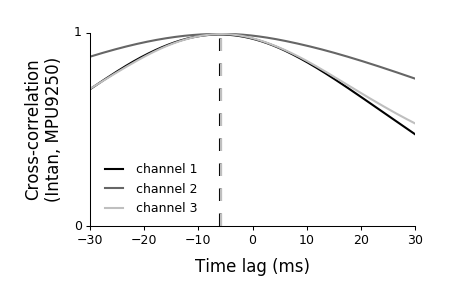

# IMUReader

Plugin for open-ephys [plugin-GUI](https://github.com/open-ephys/plugin-GUI/) to control and read data from an interia measurement unit (IMU) via an Arduino, Teensy, or another compatible microcontroller. Communication is done via i2c. Currently the following IMUs are supported:

* **LSM9DS0** the sketch can be found in "LSM0DS0" folder. Requires the Adafruit LSM9DS0 and Unified Sensor libraries. Both can be installed via the Arduino/Teensyduino IDE (Sketch -> Include Library -> Manage Libraries). For details see [here](https://learn.adafruit.com/adafruit-lsm9ds0-accelerometer-gyro-magnetometer-9-dof-breakouts/overview).
* **MPU9250** see "MPU9250" folder. No external libraries required. The current version is optimized for a Teensy but can easily be update to work with an Arduino (see comments in sketch). Hardware setup (sensor -> Teensy pin; for details see sketch): SCL -> 19, SDA -> 18, VCC -> 3.3V, GND -> GND

## Dependencies

This plugin requires the following parts

- Arduino/Teensy sketches (see above)

## Installation

Copy the IMUReader folder to the plugin folder of your GUI. Then build the all plugins as described in the [wiki](https://open-ephys.atlassian.net/wiki/display/OEW/Linux).

## Trigger signal

The Arduino/Teensy is sending a trigger pulse (~1 ms) on pin 13 (LED pin) for each recorded frame. Connect this pin (+ GND) to one of the digital inputs of the open-ephys acquisition board (e.g., via an I/O board).

## Data format
The plugin creates a "IMU_data.csv" file in the recording directory. A typical file looks like this:

\# index, timestamp, experiment, recording, ax, ay, az, gx, gy, gz, mx, my, mz  
1,3823,1,0,-0.264282,-0.040283,1.006226,-0.122070,0.244141,0.244141,118.371399,-188.796814,44.513126  
2,4829,1,0,-0.265015,-0.037842,1.007568,0.244141,-0.427246,0.000000,107.301689,-222.216766,23.146826  
3,4834,1,0,-0.265137,-0.040039,1.005737,0.183105,-0.427246,0.061035,107.301689,-222.216766,23.146826  
4,4839,1,0,-0.265625,-0.039917,1.006226,0.183105,-0.549316,0.061035,120.216354,-179.513489,32.049450  
...

Columns:

* index: index of the recorded IMU frame; each index corresponds to one sync pulse  
* timestamps: Arduino/Teensy timestamp (as returned by millis())  
* experiment: open-ephys experiment number  
* recording: open-ephys recording number 
* ax -- az: accelerometer signals (x/y/z)
* gx -- gz: gyroscope signals  
* mx -- mz: magnetometer signals

**Note:** the values are transmitted using Serial.println as writing bytes (via serialization Serial.write) was much slower (180 fps compared to < 100 fps). However, this requires setting a reasonable precision for converting float values to strings (default: 16 digits). It is possible to increase/decrease the resolution by changing the number of digits to be transmitted (variable _precision_ in MPU9250/LSM9DS0 sketches) or written (_IMUReader.cpp_ around line 64).

**Note 2:** there might be 1-2 more sync pulses (TTL in open-ephys GUI) than IMU samples (or vice versa). This is expeceted and a result of how the plugin communicates with the IMU. Simply ignore the last few pulses/samples.

Reading in Python:  
`import numpy as np`  
`data = np.loadtxt('IMU_data.csv', delimiter=',')`

## Latency
The Teensy/Arduino is sending sync pulses (3.3V or 5V) to allow synchronization of IMU with neural data. However, there is a small time lag between the sync pulses and the actual IMU data. To get the time lag for a specific IMU mechanically connect the IMU board to an Intan headstage with accelerometer (RHD2132 or RHD2164) and compute the cross-correlation of the IMU and Intan headstage accelerometer signals. For a MPU9250 sensor latencies were typcically around 5-7 ms: .

## Remarks

Note that due to the i2c standard the cable length is limited to a few meters. In my experience 1.5 meters work without any problems.

## Reading/saving data without open-ephys GUI

The Arduin/Teensy sketches can also be used without open-ephys GUI. An example script for controlling the IMU and reading/saving data can be found in the "Python" folder.

